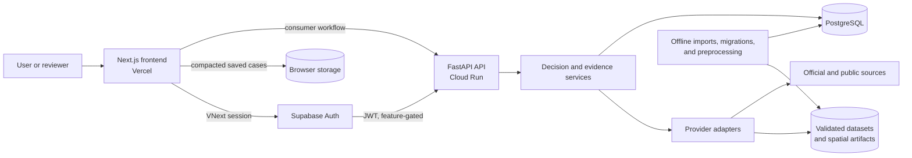

# PropTech AI Copilot

[English](README.md) | [繁體中文](README.zh-TW.md)

**An evidence-grounded decision-support system for property research in Taiwan, combining market, valuation, affordability, location, and spatial-risk evidence in one reviewable workflow.**

Property decisions depend on records held by different public agencies, map providers, financial sources, and local systems. PropTech AI Copilot integrates these uneven sources behind explicit trust boundaries: it shows what is available, where it came from, what remains unknown, and which conclusions still require professional or government confirmation. The repository is technically interesting as a full-stack information system—part data-integration platform, part spatial decision-support system, and part experiment in responsible human-AI decision workflows.

## Live Deployment

**Frontend:** [proptech-ai-copilot.vercel.app](https://proptech-ai-copilot.vercel.app/)

The public Next.js frontend and its Cloud Run FastAPI backend were reachable on 2026-09-27. The backend reported production mode, readiness, and durable PostgreSQL. A live deployment is not the same as universal data coverage: each result retains source, freshness, coverage, and unavailable-state boundaries.

Current status:

- **Live deployment:** Vercel frontend, production-mode Cloud Run API, PostgreSQL persistence, Google location services, and a partially covered PLVR market/valuation dataset.
- **Implemented:** the consumer decision workflow, deterministic financial/tax calculations, provider adapters, spatial evidence, data pipelines, release gates, and multilingual/accessibility foundations.
- **Experimental / partial:** authenticated VNext workspaces, property identity, parcel sets, planning references, satellite context, and some official-data providers.
- **Planned:** complete professional collaboration, active listings, title/ownership, a document vault, and evidence-grounded generative AI.
- **Legacy:** the root Streamlit application and competition-era Lite/demo material.

## Why This Project Exists

Evaluating a property in Taiwan is not one database lookup. A buyer or reviewer may need transaction evidence, neighborhood context, loan assumptions, recurring costs, tax conditions, parcel clues, terrain or disaster references, and confirmation from a land office or other competent authority. These facts differ in scale, freshness, authority, and accessibility.

The project explores a practical information-systems problem: how can fragmented evidence be assembled into a useful decision workflow without hiding uncertainty? Its design favors traceable intermediate evidence over a single opaque score. Missing records stay missing. A provider timeout does not become “low risk.” A sample valuation does not become official. A map point does not become a legal parcel boundary.

## What It Does

### Understand a property and its location

The live workflow resolves locations, displays map context, and summarizes nearby places. Google Geocoding and Places run behind server-side adapters; TGOS remains conditional. Leaflet, uploaded GeoJSON/KML/Shapefiles, spatial analysis, and cadastral views provide decision context—not proof of ownership, legal area, or parcel boundaries.

### Review market and valuation evidence

Controlled batches normalize official Ministry of the Interior PLVR transactions into PostgreSQL for aggregates, comparables, search, valuation ranges, and trends. On 2026-09-27, live status reported 451,672 official rows across 21 cities/counties and 317 districts, plus 72 labelled sample rows. This dated snapshot has partial—not complete Taiwan—coverage; its outputs are not appraisals, bank valuations, or price guarantees.

### Test affordability and ownership assumptions

Deterministic services calculate loan, affordability, and holding-cost scenarios. TaxOracle returns eligibility, risk, rule traces, missing information, and follow-up prompts from versioned rules. Template explanations cannot alter outcomes or invent legal conclusions. These outputs are planning references, not underwriting, filings, or professional advice.

### Inspect terrain and disaster-risk evidence

Terrain analysis keeps layers separate rather than producing an unqualified safety score. Paths include ARDSWC tiles, GeologyCloud polygons, WRA flood artifacts, conditional NLSC observations, and optional Sentinel-2 context. Layer states remain explicit; incomplete evidence cannot produce an unrestricted “safe” conclusion or replace official and engineering review.

### Assemble a decision case

The frontend assembles evidence into summaries, comparisons, notes, readiness checks, and reports. Compacted browser cases exclude detailed provider payloads, precise locations, POIs, and comparables. A feature-gated VNext foundation adds authenticated workspaces, durable evidence, identity candidates, human confirmation, parcel sets, and PostgreSQL row-level security; it is not a completed professional product.

## System Architecture



The separation is deliberate. FastAPI owns validation, policy, and orchestration; domain services own deterministic calculations and evidence contracts; adapters normalize external sources and bounded artifacts. PostgreSQL stores durable market, evidence, pilot, and VNext data. Heavy imports and spatial preprocessing publish to PostgreSQL or versioned artifacts outside the request path. See [System Architecture](docs/ARCHITECTURE.md) for the consumer/VNext boundary and deployment detail.

## Data & Evidence Sources

| Source | Purpose | Integration status | Trust / coverage note |
| --- | --- | --- | --- |
| Ministry of the Interior PLVR | Transactions, market aggregates, comparables, valuation | **Live verified** | Partial, mixed dataset; historical evidence only |
| Google Geocoding / Places / Routes | Location, POIs, route context | **Live/conditional** | Credential, quota, and provider availability apply |
| TGOS | Taiwan address observations | **Implemented/conditional** | Not accepted as a complete VNext identity provider |
| ARDSWC / WRA / GeologyCloud | Landslide, flood, liquefaction references | **Implemented/partial** | Dataset-specific coverage; reference only |
| NLSC | Basemaps, terrain/cadastral/village seams | **Partial/conditional** | Map context is not legal parcel identity |
| RIS ODRP014 | Village demographics | **Implemented/conditional** | Loaded coverage and month require runtime evidence |
| TDX | MRT/commute context | **Implemented; live unavailable during audit** | Manual in-memory snapshot refresh |
| Central Bank Open Data | Mortgage-rate background | **Implemented/conditional** | Not a borrower-specific lending offer |
| Sentinel-2 / Earth Engine | Recent satellite reference | **Feature-gated** | Not cadastral or statutory evidence |

The detailed [Data Sources and Integration Status](docs/DATA_SOURCES.md) explains provider code paths, failure semantics, and authority boundaries.

## Engineering Highlights

1. **Fail-closed evidence semantics.** Market, valuation, terrain, identity, and decision layers preserve no-data, limited, unavailable, and unknown states.
2. **Provider/adaptor architecture.** Normalized contracts expose credentials, timeouts, unsupported regions, demo fallbacks, and provenance to domain logic.
3. **Data-engineering separation.** PLVR, RIS, and WRA workflows validate public data outside the request path, then serve bounded PostgreSQL or indexed-artifact queries.
4. **Deterministic decisions before explanation.** Financial and tax services calculate outcomes; downstream explanation cannot alter them.
5. **Spatial and operational trust controls.** Geometry parsing remains separate from legal authority, while checksums, RLS, origin controls, request limits, privacy-aware storage, release gates, and recovery runbooks protect system boundaries.

## Selected Production / Validation Evidence

- On 2026-09-27, the Vercel frontend returned HTTP 200; the Cloud Run health endpoint reported production mode, readiness, and durable PostgreSQL.
- Google geocoding/Places reported enabled, while the PLVR market read model reported available with partial coverage.
- Automated validation spans Python service, API, data, migration, security, and trust-boundary checks; Node/TypeScript contracts; and Playwright user journeys.
- The hermetic release gate passed the full Python suite and its registry, market, valuation, privacy, deployment, recovery, and accessibility checks during this audit.
- The Next.js 16.3.3 production build passed compilation, TypeScript validation, and route generation.

These are validation observations, not claims about user adoption or permanent uptime. Reproduction and scope are documented in [Engineering and Validation](docs/ENGINEERING.md).

## Research & Product Relevance

This repository is an engineering artifact with clear relevance to information systems and digital transformation. It studies how heterogeneous public and private-facing data can be normalized, governed, and presented as operational evidence. The property journey is a spatial decision-support problem: location, market, risk, and financial signals must be interpreted together while preserving scale, coverage, and authority.

It also provides a concrete human-AI workflow boundary. Deterministic systems produce facts and calculations; an explanation layer may help a person understand them; the person remains responsible for resolving conflicts and obtaining authoritative confirmation. That architecture creates opportunities for future evaluation of decision quality, data provenance comprehension, interface trust, and the operational effect of evidence-aware automation. It is not presented as a peer-reviewed research contribution.

## My Role

My contributions span product and decision-workflow design, GIS and public-data integration, full-stack implementation, database and pipeline engineering, trust-boundary design, QA, deployment validation, and technical documentation.

The repository documents this work through source code, tests, architecture records, and production-acceptance artifacts. The project has involved collaboration; this section does not imply sole authorship, a particular job title, or a contribution percentage.

## Technology

| Area | Technology |
| --- | --- |
| Frontend | Next.js 16, React 19, TypeScript, Tailwind CSS, Leaflet |
| Backend | Python, FastAPI, Pydantic, Uvicorn |
| Data | PostgreSQL, Supabase, psycopg, SQL migrations, object-storage artifacts |
| Spatial | Shapely, pyproj, pyshp, Mapbox Vector Tile, GeoJSON/KML/Shapefile |
| Providers | PLVR, Google Maps services, TGOS, TDX, NLSC, ARDSWC, WRA, RIS, Earth Engine |
| Quality | Pytest, Playwright, Node test runner, ESLint, TypeScript, GitHub Actions |
| Deployment | Vercel, Cloud Run, Docker; Render configuration retained |

## Repository Structure

```text
backend/         FastAPI routes and application entry point
frontend_next/   Next.js product frontend and browser acceptance tests
services/        Domain services, adapters, providers, persistence, security
database/        SQL schemas, migrations, registry, verification
tests/           Python API, service, contract, migration, and safety tests
scripts/         Data, migration, release, smoke, and operations tooling
docs/            Architecture, data, trust, validation, and runbooks
data/            Curated samples and runtime reference catalogs
```

## Running Locally

Prerequisites: Python 3.12+, Node.js, npm, and Git.

```powershell
python -m pip install -r requirements.txt
cd frontend_next
npm ci
cd ..
```

In separate PowerShell terminals:

```powershell
.\scripts\start_backend.ps1
.\scripts\start_frontend.ps1
```

Open `http://localhost:3000`. External providers and PostgreSQL-backed capabilities require the environment configuration described in `.env.example`, `frontend_next/.env.example`, and the documentation. Never place production credentials in the repository.

## Documentation

Start with the [documentation index](docs/README.md).

- [System architecture](docs/ARCHITECTURE.md)
- [Data sources and status](docs/DATA_SOURCES.md)
- [Engineering and validation](docs/ENGINEERING.md)
- [Technical case study](docs/PORTFOLIO_CASE_STUDY.md)

## Limitations & Responsible Use

- Public-data coverage and freshness vary. “Unavailable” and “no match” do not mean “no risk.”
- The live PLVR dataset is substantial but incomplete, partially covered, and mixed with a small labelled sample set.
- Valuation is not a formal appraisal, transaction guarantee, investment recommendation, or bank valuation.
- Loan and rate outputs are scenarios, not underwriting or credit approval.
- TaxOracle is a preliminary rule-based screening aid, not legal, tax, or filing advice.
- Terrain, flood, liquefaction, satellite, and cadastral views are references; consult current official records and qualified professionals.
- A map coordinate or raster layer does not establish parcel identity, boundary, area, title, or ownership.
- Consumer saved cases are browser-local. VNext durable identity/workspace features remain partial and feature-gated.
- Current explanations are templates. Evidence-grounded generative AI and RAG are future directions, not implemented claims.
- The product is an active engineering/research portfolio and should not be used as the sole basis for a property, legal, financial, or safety decision.

## License / Status

**Status:** active engineering/research portfolio and decision-support system with a verified live consumer deployment and experimental professional foundations.

No license file is currently present. Public visibility does not grant permission to copy, modify, or redistribute the code. A license should be selected explicitly by the repository owner before describing the project as open source.
