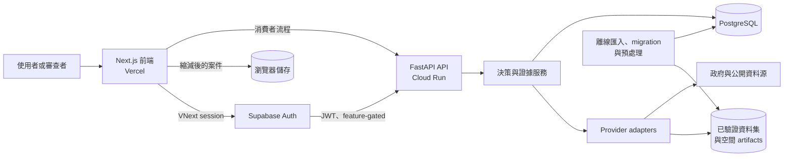

# PropTech AI Copilot

[English](README.md) | [繁體中文](README.zh-TW.md)

**以可追溯證據支援台灣不動產研究與決策，將市場、估值、負擔能力、區位與空間風險資訊整合為可檢視的工作流程。**

不動產決策所需資料分散在不同政府機關、地圖服務、金融資料源與地方系統，彼此的時效、範圍與權威程度並不相同。PropTech AI Copilot 將這些資料整合在明確的信任邊界後方：系統會說明目前取得了什麼、資料從哪裡來、哪些資訊仍然未知，以及哪些結論仍須由專業人士或主管機關確認。從工程角度看，這是一套結合資料整合、空間決策支援與人機協作設計的全端資訊系統。

## 線上系統

**前端：** [proptech-ai-copilot.vercel.app](https://proptech-ai-copilot.vercel.app/)

2026-09-27 查核時，公開的 Next.js 前端與 Cloud Run FastAPI 後端皆可連線；後端回報已進入 production 模式、readiness 正常，並可使用具持久性的 PostgreSQL。這是一套可驗證的 live deployment，不等同成熟商用 SaaS，也不代表每一種資料都已完整涵蓋全台；各項結果仍分別保留來源、更新時間、涵蓋範圍與不可用狀態。

目前狀態如下：

- **Live deployment：** Vercel 前端、production-mode Cloud Run API、PostgreSQL、Google 定位服務，以及具部分涵蓋範圍的 PLVR 市場與估值資料。
- **已實作：** 消費者決策流程、確定性財務與稅務計算、provider／adapter 架構、空間證據、資料管線、release gate、多語與無障礙基礎。
- **實驗中／部分完成：** VNext 驗證工作區、不動產身分解析、多筆地號案件、都市計畫參考、衛星影像，以及部分政府資料來源。
- **規劃中：** 完整專業協作、在售物件、產權／所有權、文件庫與證據導向的生成式 AI。
- **Legacy：** 根目錄的 Streamlit 應用與競賽時期的 Lite／demo 文件。

## 為什麼做這個專案

在台灣評估一間房子，通常不可能只查一個資料庫。買方或分析者可能同時需要實價登錄、生活機能、房貸假設、持有成本、稅務條件、地籍線索、地形與災害資訊，最後還要向地政事務所或其他主管機關確認。這些證據的尺度、更新頻率、法律效力與取得方式都不同。

本專案探索的是一個實際的資訊系統問題：如何把分散的證據組成有用的決策流程，又不掩蓋不確定性？因此系統不追求單一、難以解釋的總分，而是保留可檢查的中間證據。查不到資料就是查不到；provider timeout 不會變成「低風險」；展示估值不會被包裝成官方估價；地圖上的點也不等於合法地界。

## 系統能做什麼

### 理解物件與區位

消費者流程可輸入物件與區位條件、解析地址、顯示地圖情境，並整理周邊設施。Google Geocoding 與 Places 透過後端 adapter 整合；TGOS 與其他資料源則依憑證與環境設定而定。Leaflet 提供多種公開底圖；選用的 Google 視覺情境則使用獨立、受 API 與 referrer 限制的瀏覽器金鑰。

系統也支援使用者上傳 GeoJSON、KML 與 Shapefile，進行受限的空間檢查與地籍參考呈現。這些工具可以協助 GIS 判讀，但不能證明所有權、法定面積或合法地界。

### 檢視市場與估值證據

內政部 PLVR 實價登錄資料透過受控批次流程取得，經正規化後寫入 PostgreSQL，再提供區域行情、分群、可比案例、物件搜尋、估值區間與歷史趨勢情境。

2026-09-27 的線上狀態顯示 451,672 筆官方資料，涵蓋 21 個縣市與 317 個行政區，另有 72 筆明確標示邊界的 sample。服務本身明確標示這不是全台完整涵蓋。估值結果是決策參考，不是正式不動產估價、銀行鑑價或成交價格保證。

### 測試負擔能力與持有假設

系統以確定性服務計算本息攤還、負擔能力情境與預估持有成本。TaxOracle 對結構化輸入套用規則，輸出資格、風險、rule trace、缺少資料與後續確認事項。

目前的說明層採固定模板，只能重述結構化結果，不能變更規則判定或新增法律結論。銀行利率與稅務輸出是規劃參考，不是授信、報稅或專業意見。

### 檢查地形與災害風險證據

地形分析保留各圖層自己的狀態，不把不同來源壓成一個沒有前提的安全分數。已實作的路徑包括 ARDSWC 圖磚、GeologyCloud 土壤液化 polygon、WRA 淹水潛勢 artifact 管線，以及條件式的 NLSC 地形觀測；Sentinel-2／Earth Engine 則是選用的參考影像。

每一圖層都可能是 available、limited、unavailable、未命中或尚未評估。證據不完整時，系統不能輸出不受限制的「安全」結論。各機關資料的涵蓋範圍與更新狀態不同，因此結果用來指引下一步查核，而不是取代工程調查或官方災害資訊。

### 組成可檢視的決策案件

前端將物件、區位、市場、估值、負擔能力、地形與稅務結果整理成階段式決策摘要、比較、看屋筆記、準備度檢查與報告流程。現行消費者案件存於瀏覽器，寫入前會縮減內容；詳細 provider payload、精確解析座標、POI 清單與可比交易明細不會保存在這個本機案件中。

另一套 VNext 基礎提供驗證工作區、持久化案件、property／evidence graph、身分候選與人工確認，以及具 PostgreSQL row-level security 的多筆地號案件。這些能力仍有 feature flag，不應被描述成已完成的專業產品。

## 系統架構



這個分工不是形式上的分層。FastAPI 負責驗證、政策與協調；domain service 負責確定性計算與證據 contract；adapter 正規化外部 provider 與受限 artifacts；PostgreSQL 保存市場、證據、pilot 與 VNext 資料；大型匯入與空間預處理在 request path 之外產出資料庫內容或具版本的 artifacts。詳見[系統架構](docs/ARCHITECTURE.md)。

## 資料與證據來源

| 資料源 | 用途 | 整合狀態 | 信任／涵蓋限制 |
| --- | --- | --- | --- |
| 內政部 PLVR | 交易、區域行情、可比案例、估值 | **線上已驗證** | 部分涵蓋、混合資料；僅為歷史證據 |
| Google Geocoding／Places／Routes | 定位、POI、路線情境 | **線上／條件式** | 受憑證、quota 與服務狀態影響 |
| TGOS | 台灣地址觀測 | **已實作／條件式** | 尚不是完整 VNext 身分 provider |
| ARDSWC／WRA／GeologyCloud | 崩塌、淹水、液化參考 | **已實作／部分完成** | 各資料集涵蓋不同，僅供參考 |
| NLSC | 底圖、地形、地籍與村里介接 | **部分／條件式** | 地圖情境不等於法定地籍身分 |
| RIS ODRP014 | 村里人口統計 | **已實作／條件式** | 實際月份與涵蓋需看 runtime 證據 |
| TDX | 捷運／通勤情境 | **已實作；查核時線上不可用** | 以人工流程更新記憶體 snapshot |
| 中央銀行 Open Data | 房貸利率背景 | **已實作／條件式** | 不是個人授信條件或 offer |
| Sentinel-2／Earth Engine | 近期衛星參考影像 | **feature-gated** | 不是地籍或法定證據 |

完整的 provider 路徑、失敗語意與權威界線請見[資料來源與整合狀態](docs/DATA_SOURCES.md)。

## 工程重點

1. **Fail-closed 的證據語意。** 市場、估值、地形、身分與決策層保留 no-data、limited、unavailable 與 unknown，不會默默提高弱證據的可信度。
2. **Provider／adapter 架構。** 憑證、timeout、不支援區域、demo fallback 與來源資訊先正規化，再交給 domain logic。
3. **資料工程與線上服務分離。** PLVR、RIS、WRA 在 request path 之外驗證與預處理，再由 PostgreSQL 或索引 artifact 提供受限查詢。
4. **先確定性判定，再產生說明。** 財務與稅務結果由規則和 service 計算；說明層不能改寫結果。
5. **空間分析保留權威界線。** 真實執行 geometry parsing 與 matching，同時區分視覺底圖、使用者圖形、災害參考與官方地籍身分。
6. **把 production 與 trust control 視為產品功能。** 包含 migration checksum、RLS、CORS／origin control、security header、request limit、correlation ID、隱私儲存、release gate 與復原 runbook。

## 生產與驗證證據

- 2026-09-27 查核時，Vercel 前端回傳 HTTP 200；Cloud Run health endpoint 回報 production、ready 與 durable PostgreSQL。
- Google geocoding／Places 顯示啟用；PLVR market read model 顯示 available、partial coverage。
- 自動化驗證涵蓋 Python service、API、資料、migration、安全與 trust-boundary checks，以及 Node／TypeScript contracts 與 Playwright 使用者流程。
- 本次稽核執行的 hermetic release gate 通過完整 Python suite，以及 registry、market、valuation、privacy、deployment、recovery、accessibility contract checks。
- Next.js 16.3.3 production build 通過編譯、TypeScript 與 route generation。

以上是有日期的驗證結果，不是使用者數量、永久 uptime 或所有外部 provider 永遠可用的聲明。重現方式與測試範圍請見[工程與驗證](docs/ENGINEERING.md)。

## 研究與產品意義

本 repository 可作為資訊系統與數位轉型的工程成果來理解：異質公私資料如何被正規化、治理，再轉換成可操作的證據；而房地產流程本身也是空間決策支援問題，區位、市場、風險與財務訊號必須一起解讀，同時保留尺度、涵蓋與權威差異。

它也提供具體的人機協作邊界：確定性系統產生事實與計算，說明層協助人理解，人仍負責處理衝突並取得權威確認。未來可進一步評估決策品質、使用者對 provenance 的理解、介面信任，以及 evidence-aware automation 對作業流程的影響。本專案不宣稱已構成同儕審查研究成果。

## 我的工作範圍

我的工作涵蓋產品與決策流程設計、GIS 與公開資料整合、前後端實作、database 與 data pipeline 工程、trust-boundary 設計、QA、部署驗證及技術文件。

Repository 透過 source code、tests、architecture records 與 production-acceptance artifacts 記錄這些工作。專案過程包含協作；本節不表示 sole authorship，也不推論職稱或貢獻比例。

## 技術組成

| 領域 | 技術 |
| --- | --- |
| 前端 | Next.js 16、React 19、TypeScript、Tailwind CSS、Leaflet |
| 後端 | Python、FastAPI、Pydantic、Uvicorn |
| 資料 | PostgreSQL、Supabase、psycopg、SQL migrations、object-storage artifacts |
| 空間 | Shapely、pyproj、pyshp、Mapbox Vector Tile、GeoJSON／KML／Shapefile |
| Providers | PLVR、Google Maps services、TGOS、TDX、NLSC、ARDSWC、WRA、RIS、Earth Engine |
| 品質 | Pytest、Playwright、Node test runner、ESLint、TypeScript、GitHub Actions |
| 部署 | Vercel、Cloud Run、Docker；保留 Render 設定 |

## Repository 結構

```text
backend/         FastAPI routes 與 application entry point
frontend_next/   Next.js 產品前端與瀏覽器驗收測試
services/        Domain services、adapters、providers、persistence、安全
database/        SQL schemas、migrations、registry、verification
tests/           Python API、service、contract、migration 與安全測試
scripts/         資料、migration、release、smoke、operations 工具
docs/            架構、資料、信任、驗證與 runbooks
data/            經整理的 samples 與 runtime reference catalogs
```

## 在本機執行

需要 Python 3.12+、Node.js、npm 與 Git。

```powershell
python -m pip install -r requirements.txt
cd frontend_next
npm ci
cd ..
```

在兩個 PowerShell terminal 分別執行：

```powershell
.\scripts\start_backend.ps1
.\scripts\start_frontend.ps1
```

開啟 `http://localhost:3000`。外部 provider 與 PostgreSQL 功能需要依 `.env.example`、`frontend_next/.env.example` 與文件設定環境；不可把 production credentials 放進 repository。

## 文件

請先閱讀[文件索引](docs/README.md)。

- [系統架構](docs/ARCHITECTURE.md)
- [資料來源與整合狀態](docs/DATA_SOURCES.md)
- [工程與驗證](docs/ENGINEERING.md)
- [技術案例研究](docs/PORTFOLIO_CASE_STUDY.md)

## 限制與負責任使用

- 公開資料的涵蓋與更新頻率不同；「不可用」或「未命中」不代表「沒有風險」。
- 線上 PLVR 資料量具規模，但仍不完整、只部分涵蓋，且混有少量明確標示的 sample。
- 估值不是正式估價、成交保證、投資建議或銀行鑑價。
- 房貸與利率輸出是情境，不是授信或核貸結果。
- TaxOracle 是初步規則篩檢，不是法律、稅務或申報意見。
- 地形、淹水、液化、衛星與地籍畫面僅供參考；應查核最新官方資料並諮詢合格專業人士。
- 地圖座標或 raster layer 不能建立地號、地界、面積、產權或所有權。
- 消費者案件目前保存在瀏覽器；VNext 的持久化身分／工作區仍為部分完成且 feature-gated。
- 現行說明層採模板。Evidence-grounded generative AI 與 RAG 是未來方向，不是目前功能。
- 這是持續開發中的工程／研究 portfolio，不應作為不動產、法律、財務或安全決策的唯一依據。

## 授權與狀態

**狀態：** 持續開發中的工程／研究 portfolio 與決策支援系統；具可驗證的 live consumer deployment，專業版基礎仍在實驗階段。

Repository 目前沒有 license file。公開可見不代表授權他人複製、修改或散布；在把本專案描述為 open source 之前，應由 repository owner 明確選擇授權條款。
