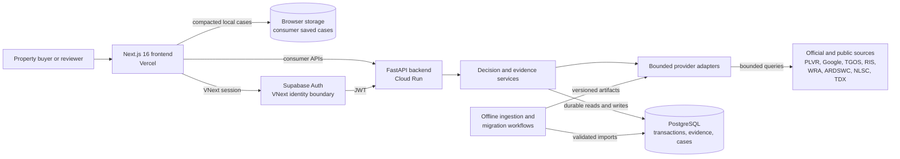

# System Architecture

This document describes the architecture implemented at `origin/main` commit `1095135` and the production state observed on 2026-09-27. It separates the live consumer decision workflow from the feature-gated professional VNext foundation.

## Architecture at a glance

The diagram is intentionally small: the browser presents the workflow; FastAPI owns server-side policy and orchestration; services normalize decision evidence; adapters isolate external providers; PostgreSQL holds durable data; offline workflows keep heavy ingestion away from request handling.

## Current consumer system

The public entry point is the stateful Next.js application in `frontend_next/app/page.tsx`. It organizes property research around user decisions rather than backend modules: identify a property or location, understand nearby context and market evidence, estimate price and affordability, inspect risk references, and assemble a decision summary.

The frontend calls typed functions in `frontend_next/lib/api.ts`. The backend registers domain routers in `backend/api_main.py` for:

- location and map intelligence;
- commute and routing;
- market aggregates, segmentation, and comparables;
- property search and valuation;
- loan and holding-cost calculations;
- TaxOracle analysis and reports;
- terrain, satellite, and parcel-geometry evidence;
- RIS demographics;
- pilot/review evidence and production readiness.

Current consumer saved cases are local to the browser. `frontend_next/lib/case-storage.ts` caps them at ten and deliberately removes raw matched transactions, detailed comparables, resolved coordinates, and POI lists before persistence. This is useful for a personal decision workflow, but it is not the same as a durable, multi-user case system.

## Backend organization

FastAPI routers validate transport-level requests and delegate to services. Most business and data decisions live under `services/`:

- deterministic calculation services for loans, holding costs, tax, and valuation contracts;
- market/PLVR ingestion, coverage, freshness, aggregate, segmentation, and reconciliation services;
- location, commute, map, parcel, terrain, demographics, and satellite services;
- persistence, production configuration, security, metrics, and observability services;
- `services/vnext/` for authenticated workspace, identity, evidence, property-graph, and parcel-set foundations.

External systems are kept behind adapters or providers. This makes a provider failure a data-status problem rather than an excuse to invent a result. Provider code normalizes timeouts, missing credentials, unsupported regions, incomplete responses, and no-match states into bounded contracts.

## Evidence and decision flow

The system keeps calculation and presentation responsibilities separate:

1. User input and provider observations are normalized into typed results.
2. Deterministic services calculate values or rule outcomes.
3. Each result carries origin, status, coverage, freshness, limitations, or reason codes where the domain requires them.
4. Frontend state adapters distinguish available, limited, no-data, unavailable, and network-error views.
5. Decision summaries combine only evidence that passes the relevant trust boundary.
6. Missing terrain evidence cannot become an unrestricted safe signal, and unavailable valuation data cannot silently become an official estimate.

TaxOracle illustrates this boundary clearly: rules determine eligibility and risk; the “AI explanation” service currently renders a stable template from the structured result. It cannot change the rule outcome or add a legal conclusion.

## Data and persistence

PostgreSQL is the durable backend. Migrations 001–011 cover transaction/valuation data, market coverage and read models, pilot evidence, tax history, and a migration ledger. Migrations 012–019 add deny-by-default security, workspaces and cases, property graphs and evidence, identity resolution and confirmation, legacy-case import, parcel sets, and RIS village demographics.

Database access is intentionally split by responsibility:

- standard application and pilot persistence;
- valuation/PLVR providers and compact read paths;
- authenticated VNext access through a constrained database principal;
- scripts for migrations, validated imports, reconciliation, backup, and recovery.

Raw public-data acquisition and expensive spatial processing run outside the web request path. For example, the PLVR pipeline validates and imports batches into Postgres, while the WRA flood path builds a bounded artifact that the runtime loader verifies and indexes. Production startup does not fetch national archives.

## Provider boundaries

Provider integration has several distinct meanings:

- an adapter exists;
- credentials or a gateway are configured;
- a dataset is loaded;
- a bounded production call succeeds;
- geographic coverage and freshness are known;
- legal/operational acceptance is complete.

The architecture does not collapse these states. `docs/DATA_SOURCES.md` records them source by source. This matters particularly for TGOS/NLSC identity evidence, terrain layers, TDX snapshots, Earth Engine, and the newest RIS workflow.

## VNext professional foundation

The `/v1` API and related frontend routes are an experimental professional architecture, not a relabeling of the consumer app. They add:

- authenticated principals and workspace membership;
- server-side role checks and forged-identity rejection;
- durable cases and property/evidence graphs;
- identity candidates, human confirmation, conflict handling, and case attachment;
- manual parcel/building hypotheses and durable multi-parcel case sets;
- copy-only legacy case import;
- a bounded Taipei manual planning-reference contract.

PostgreSQL RLS is forced for the relevant schemas, and tests exercise database principals and tenant isolation. However, identity, legacy-import, parcel-set, and Taipei-planning flags default off. The production identity engine contains no accepted provider. The current public homepage therefore must not be described as a complete professional identity or collaboration platform.

## Deployment topology

On 2026-09-27, the public frontend was served by Vercel and its configured Cloud Run backend reported production readiness with durable PostgreSQL available. The repository supports this topology through the Next.js package, `Dockerfile.cloudrun`, environment validation, health/readiness routes, and hosted smoke/release workflows.

`render.yaml` remains a FastAPI deployment declaration and operational reference. It does not establish that Render is the current live backend. The root `Dockerfile` runs the legacy Streamlit application and should be treated as a backup/demo artifact.

Secrets are environment-managed. Public configuration files contain variable names and validation rules, not production credential values.

## Security and operational controls

The request boundary provides explicit CORS origins, origin checks for unsafe methods, body-size limits, correlation IDs, maintenance mode, security headers, safe VNext errors, and bounded metrics labels. Production-like startup fails when core configuration is unavailable or malformed.

Operations are separated into local/CI scripts and protected routes for migration, PLVR imports, read-model refresh, coverage audit, commute refresh, release evidence, backup/restore, and smoke checks. Destructive data maintenance is guarded by dry-run and explicit-confirmation semantics.

## Known architectural boundaries

- Consumer cases remain browser-local; VNext durable cases are separate and feature-gated.
- Property identity has strong contracts but no production-accepted identity provider.
- Official parcel/building identity and legal parcel polygons are not established.
- Not every public data source has proven nationwide coverage, freshness, or hosted acceptance.
- The production PLVR dataset is substantial but partial and mixed with a small demo sample.
- Transit status was unavailable during the audit.
- Current explanations are deterministic templates, not a live LLM or RAG workflow.
- Active listings, title/ownership, document vault, CRM, and complete team collaboration are not current production workflows.

These boundaries are part of the architecture: unknown and unavailable states are retained so later data or AI layers cannot upgrade weak evidence into stronger claims.
