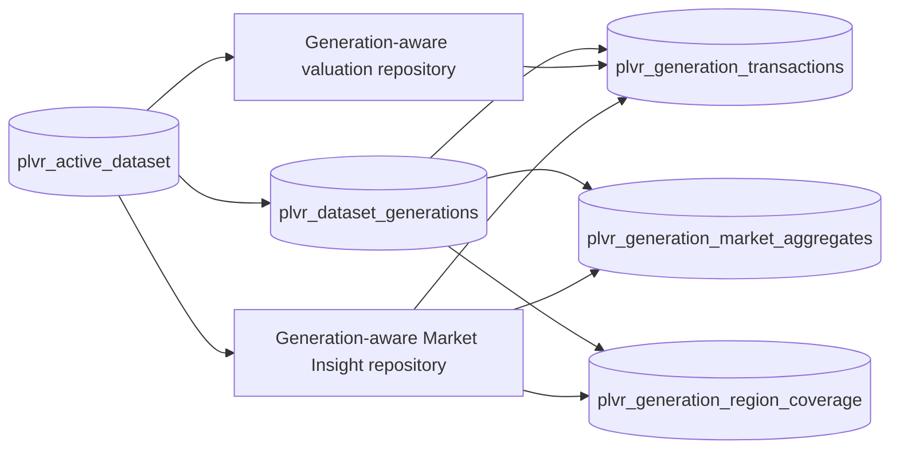

# PLVR Authoritative Shadow Cutover Design Phase 2D

## Decision and boundary

`READY_FOR_CUTOVER_DRY_RUN`

This is a design decision only. It permits a later, non-production rehearsal;
it does not authorize production schema changes, data loading, aggregate
building, reader switching, deployment changes, or legacy deletion. Phase 2D
made no production connection and performed no production mutation.

Baseline evidence:

- Main: `93679c25a7c34779c7b397010406ca09448d7e50`
- Verified production snapshot: `451672` rows, SHA-256
  `d18823a8e9953fd78598f3aa428b43e302dd1af1ce6d6338ca4ceabbaa6b9d33`
- Authoritative candidate: `517195` rows covering `2023-09` through
  `2026-07`
- Candidate aggregate baseline: `9606` scopes
- Candidate canonical geography: `21` cities and `325` geographic units
- Phase 2C.7 aggregate reconciliation: `9121` fully explained, `121`
  partially explained, `0` unexplained scopes
- Seven golden regions are internally consistent and their latest publishable
  period is `2026-07`

## Current physical architecture

```mermaid
flowchart LR
  A[Official PLVR artifacts] --> B[import_plvr_to_postgres]
  B --> C[(real_price_transactions)]
  B --> D[(valuation_import_runs)]
  C --> E[PostgresValuationProvider]
  E --> F[/valuation estimate trend property-search]
  C --> G[Direct Market queries]
  G --> H[/market-insights/query]
  C --> I[read-model refresh]
  I --> J[(market_district_period_aggregates)]
  J --> K[status catalog regions]
  C --> L[(market_region_coverage)]
  L --> H

  M[Official release pipeline] --> N[(official_market_releases)]
  M --> O[(market_transactions)]
  M --> P[(market_region_period_aggregates)]
  M --> Q[(official_market_region_coverage)]
  O --> R[/market-insights/comparables]
  P --> S[official aggregate adapter]
  T[(schema_migration_ledger)] --> N
```

### Live transaction and valuation contract

`database/valuation_schema.sql` defines `real_price_transactions`. Its primary
key is generated `id`; official import uniqueness is the partial unique index
on `(source, dedupe_key)` when `dedupe_key` exists. Valuation, trend, property
search, and the live Market Insight direct-query path require period, city,
district, road, building type, area, age, floor, total floor, unit price, total
price, source, dedupe key, and import time. Optional coordinates and raw notes
are not necessary for generation routing.

The exact live reader columns are `transaction_period`, `city`, `district`,
`road`, `address_text`, `building_type`, `area_ping`, `building_age_years`,
`floor`, `total_floor`, `unit_price_per_ping`, `total_price`, `lat`, `lng`,
`source`, `dedupe_key`, and `imported_at`. The table has no generation foreign
key. The related `valuation_import_runs` table records source, period, scope,
counts, status, and import time but is not an active read pointer.

`PostgresValuationProvider` queries `real_price_transactions` directly and
filters official rows by `source = official_plvr_opendata`. Production provider
failure returns an unavailable provider. Sample valuation data is reachable
only in explicit demo mode; no production fallback should be represented as
official.

### Market Insight contract

`PostgresMarketReadModelRepository` currently has split behavior:

- Summary, history, and direct coverage aggregate from
  `real_price_transactions` in read-only query transactions.
- Status, catalog, and region discovery read
  `market_district_period_aggregates`.
- Persisted direct coverage metadata uses `market_region_coverage`.
- Protected refresh can replace `market_district_period_aggregates`; protected
  coverage operations can create indexes or update coverage metadata.

`market_district_period_aggregates` is keyed by county, district, and period
and stores average unit price, transaction and record counts, source, update
date, coverage/data states, aggregation method, and build time.
`market_read_model_metadata` is keyed by read-model version and stores refresh,
coverage, period, region-count, source, and build metadata. Neither table has a
generation foreign key. No stable generation-aware SQL view currently exists.

The public routes include status, catalog, regions, query, methodology,
releases, comparables, and protected refresh/coverage operations. Reader errors
fail closed to safe unavailable states.

### Release-based official pipeline

Migrations 008 and 009 define a separate release model:

- `official_market_releases` with one partial-unique active release flag
- `official_market_artifacts`
- `market_transactions`
- `market_transaction_quality_events`
- `market_region_period_aggregates`
- `official_market_region_coverage`
- `market_import_runs` and `market_import_checkpoints`

All release-scoped transaction, aggregate, coverage, artifact, quality-event,
run, and checkpoint rows reference their release metadata using the migration
008/009 foreign-key policies. Aggregate identity is release, county, district,
period, and transaction type. Transaction identity is `transaction_id`, with a
release-scoped dedupe-fingerprint uniqueness constraint. These contracts are
useful evidence but cannot replace the valuation-compatible generation
contract without additive fields and generation-aware readers.

The release adapter is used by methodology, release, comparable, and official
aggregate paths, but it is not the live valuation or direct Market Insight
router. Its transaction shape also lacks road, address, building age, floor,
and total floor required by current valuation readers. A single active release
does not represent the multi-artifact authoritative clean generation.

### Migration, runtime, and deployment

`schema_migration_ledger` records migration ID, schema version, release version,
checksum, and applied time. The reviewed runner applies migrations 004 through
009 and fails on checksum drift. Earlier valuation and market indexes are
defined separately in the base schema and migrations 001 through 003.

The central production configuration contract selects `DATABASE_URL`, with
`PILOT_EVIDENCE_DATABASE_URL` as a compatibility alias. Current valuation and
Market Insight repositories still select `VALUATION_DATABASE_URL` directly.
Render starts FastAPI with `backend.api_main:app`; Vercel is the frontend and
must not own database generation selection. A future implementation must make
the backend readers use one reviewed server-side PostgreSQL connection
selection before a cutover rehearsal.

The repository already disables psycopg automatic prepared statements, which
is compatible with Supabase transaction-mode pooling. The preferred design
does not rely on session state, so connection reuse cannot pin a generation.

## Target blue/green model

The target is an additive, generation-scoped data model:



The names are design names, not applied schema. The current contaminated data
is registered or treated as the blue legacy generation without rewriting it.
The clean candidate is green and remains inactive through loading, aggregate
building, validation, and shadow comparison.

The active-pointer row binds one dataset key to one `generation_id`. Both
transaction and aggregate repositories resolve that same ID in their query
transaction. This prevents a mixed state where valuation or transaction reads
use green while Market Insight aggregates use blue.

## Switch strategy decision

The selected mechanism is `metadata_backed_active_generation_id`.

| Strategy | Atomicity and rollback | Render / pool behavior | Supabase/Postgres risk | Decision |
| --- | --- | --- | --- | --- |
| Runtime configuration selector | Weak across deployments; rollback waits for propagation | Instances can disagree | Selector is outside the DB transaction | Reject |
| Stable SQL view | Strong transactional replacement | Compatible after reader deployment; cached plans need review | Permissions, view dependencies, and security-invoker policy | Not preferred |
| Metadata active generation | One pointer-row commit; rapid reversal | No session state; each query sees a committed pointer | Native additive tables and transactional pointer | **Select** |
| Physical rename/swap | Transactional DDL | Relation-cache and restart risk | Locks and dependencies | Reject |
| Application provider switch | Weak without shared state | Coordinated deploy required | Cannot guarantee one DB snapshot across readers | Reject |

The metadata pointer is observable, testable, independent of Vercel, and safe
under connection pooling because it does not use session variables. A future
switch transaction must lock and update the single pointer row, record the old
generation as rollback target, and commit only after both transaction and
aggregate generation invariants are proven.

## Authoritative target contract

The generation transaction contract preserves every valuation fact and adds
immutable lineage:

- generation and transaction identities
- artifact and source-row SHA-256 values
- source identity plus official transaction and transfer identifiers
- transaction period and publishability status
- canonical city, district, and geographic-unit kind
- road and restricted address text
- building type, area, age, floor, and total floor
- unit and total price
- source release, source name, dedupe key, and normalization metadata

Within a generation, source-row hash and accepted business dedupe key are
unique. Official source revision selection must be deterministic. Legacy IDs
may be retained as non-authoritative forensic metadata, but may not displace
clean authoritative identity. The candidate cannot become active before its
manifest is frozen and all lineage invariants pass.

## Ambiguity execution policy

| Cohort | Treatment |
| --- | --- |
| 268 strong-fact duplicate production rows / 134 groups | `IGNORE_OLD_AND_REPLACE_FROM_CLEAN` |
| 458 conflicting production rows | `RETAIN_FOR_FORENSICS_ONLY`; manual policy before execution |
| 460 bounded clean candidates | Use complete clean group membership; do not guess old-to-new row permutation |
| 131140 production-only rows | `PRESERVE_IN_LEGACY_GENERATION`; do not copy into green publishable membership |
| 196796 clean rows absent from production | `IGNORE_OLD_AND_REPLACE_FROM_CLEAN` |
| One source-confirmed future row | `EXCLUDE_FROM_PUBLISHABLE`; retain forensic evidence |
| Historical 57350 partially reproducible cohort | `RETAIN_FOR_FORENSICS_ONLY`; never drive row deletion |

The cutover replaces publishable membership from the clean generation. It does
not repair ambiguous legacy rows one by one and never authorizes deletion.

## Candidate load and aggregate design

The future loader is generation-scoped, idempotent, checkpointed, restartable,
and auditable. It begins at bounded 5000-row batches and may increase only to a
reviewed limit of 10000. Each batch commits independently to an inactive
generation using `(generation_id, source_row_hash)` as the idempotency key.
Identity conflicts fail the batch; they never silently overwrite a row.

Before and after loading, validate the frozen manifest SHA, every artifact
hash, expected row count, rolling checkpoint hash, lineage completeness,
canonical geography, future-period exclusion, and duplicate identities. A
failed or partial generation remains inactive.

Aggregates are built only from publishable rows in the same candidate
generation. The key is generation, canonical city, canonical district,
geographic-unit kind, and period. Current market metrics are preserved and
linked to generation, manifest, source update, and build timestamps. Existing
production aggregate rows are never copied. Candidate aggregates stay hidden
until candidate validation and the single pointer commit.

## Validation and golden regions

Hard gates are machine-readable in
`artifacts/plvr_cutover_validation_gates.json`. Frozen baselines are exact;
newer releases may change counts or periods only when a newly approved manifest
proves the change. Any unexplained change fails closed.

The seven golden regions are:

- Taipei City, Zhongzheng District
- Taipei City, Nangang District
- Taichung City, Beitun District
- Taoyuan City, Pingzhen District
- Taoyuan City, Zhongli District
- Kaohsiung City, Xiaogang District
- Kaohsiung City, Sanmin District

The committed artifact retains canonical Chinese names. Each region must have
nonempty authoritative history, a valid latest period, no publishable future
period, explainable transaction membership, same-generation aggregate
consistency, safe valuation and Market Insight states, source and freshness
metadata, and no fabricated official fallback. Equality to contaminated blue
data is not required.

## Shadow verification, cutover, and rollback

During shadow verification, `LIVE_BLUE` remains user-facing and
`CANDIDATE_GREEN` is queried only by the comparison harness. It compares Market
Insight, valuation, coverage, status, catalog, and golden-region behavior.
Expected corrections, added coverage, duplicate removal, and future exclusion
are distinct from unexpected value, missing-data, and schema failures. Any
unexpected class blocks switch approval.

The last point with no user-visible change is completion of read-switch
approval. The first user-visible change and cutover commit point are both the
commit of the atomic active-generation pointer transaction. Post-switch
acceptance starts immediately.

Rollback restores the recorded prior generation ID in one transaction; it does
not restore hundreds of thousands of rows. Target rollback verification is
under five minutes. The failed candidate remains intact for analysis. Health,
SQL, zero-result, golden-region, material delta, valuation, coverage, future,
or generation-consistency failures are hard rollback triggers.

## Observability and approval boundary

Safe telemetry includes active and candidate generation IDs, row and aggregate
counts, latest publishable period, invalid/future/lineage counts, health,
golden-region and shadow-comparison status, cutover time, and rollback
availability. It excludes connection values, raw rows, addresses, and source
payloads.

Five independent owner approvals are required before schema creation,
candidate writes, aggregate writes, reader switching, and legacy retirement.
Phase 2D grants none of them. Legacy retirement and deletion are a separate
later phase after retention and audit review.

## Design gate

`READY_FOR_CUTOVER_DRY_RUN`

The next permissible activity is a non-production dry-run rehearsal using the
committed plan and validator. Production execution remains unauthorized.
